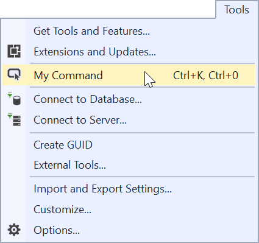

# Custom commands example

**Applies to Visual Studio 2015 and newer**

This sample shows how to add your own menu button to Visual Studio.

Clone the repo to test out the sample in Visual Studio 2017 yourself.

## What is a command?
A command is code that Visual Studio will execute when it is being invoked. Most common, commands are buttons in menus or toolbars and can have keyboard shortcuts mapped to them.



It's easy to create commands in a Visual Studio extension.

## Let's get started
In your VSIX project, add a new item by right-clicking the project and selecting **Add -> New Item...** and then search for and select **Custom Command**. 

This will create a bunch of files to your project. The key ones are:

1. The .vsct file
2. The command Class
3. The Package class

**The .vsct file** is where we defined what commands we want to add, what their names and icons are and where they are located (what menu or toolbar to add them to).

```xml
<Groups>
  <Group guid="guidMyCommandPackageCmdSet" id="MyMenuGroup" priority="0x0600">
    <Parent guid="guidSHLMainMenu" id="IDM_VS_MENU_TOOLS"/>
  </Group>
</Groups>

<Buttons>
  <Button guid="guidMyCommandPackageCmdSet" id="MyCommandId" priority="0x0100" type="Button">
    <Parent guid="guidMyCommandPackageCmdSet" id="MyMenuGroup" />
    <Strings>
      <ButtonText>AVAS: package scanner</ButtonText>
    </Strings>
  </Button>
</Buttons>
```

The XML in the .vsct file specifies a button that is parented to a group, which is parented to a build-in menu - the top level *Tools* menu.

[See full .vsct file in source](src/VSCommandTable.vsct)

A button MUST always be inside a group and a group MUST always be inside a menu/toolbar.

**The command class** contains the code that initializes the command as well as code to be execute when the command is invoked.

```c#
internal sealed class MyCommand
{
    public static async Task InitializeAsync(AsyncPackage package)
    {       
        var commandService = await package.GetServiceAsync((typeof(IMenuCommandService))) as OleMenuCommandService;

        var cmdId = new CommandID(Guid.Parse("2b40859b-27f8-4dc6-85b1-f253386aa5f6"), 0x0100); 
        var cmd = new MenuCommand((s, e) => Execute(package), cmdId);
        commandService.AddCommand(cmd);
    }

    private static void Execute(AsyncPackage package)
    {
        // Do something
    }
}
```

[See full command class in source](src/Commands/MyCommand.cs)

**The Package class** is initialized automatically the first time the command is being executed. In the package `InitializeAsync` method, the `MyCommand.InitializeAsync(this)` will initialize the command before it is being executed.

```c#
public sealed class MyPackage : AsyncPackage
{
    [ProvideMenuResource("Menus.ctmenu", 1)]
    [Guid("fa24d542-0b4d-4f6b-ac03-24ff47c11b76")]
    protected override async Task InitializeAsync(CancellationToken cancellationToken, IProgress<ServiceProgressData> progress)
    {
        await JoinableTaskFactory.SwitchToMainThreadAsync(cancellationToken);

        await MyCommand.InitializeAsync(this);
    }
}
```

[See full Package class in source](src/MyPackage.cs)

## Further reading
Read the docs for all the details surrounding these scenarios.

* [VSCT Schema Reference](https://docs.microsoft.com/en-us/visualstudio/extensibility/vsct-xml-schema-reference)
* [Use AsyncPackage with background load](https://docs.microsoft.com/en-us/visualstudio/extensibility/how-to-use-asyncpackage-to-load-vspackages-in-the-background)
* [Use Rule-based UI Context](https://docs.microsoft.com/en-us/visualstudio/extensibility/how-to-use-rule-based-ui-context-for-visual-studio-extensions)
* [VisibilityConstraints sample](https://github.com/madskristensen/VisibilityConstraintsSample)
